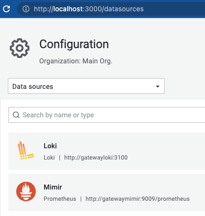
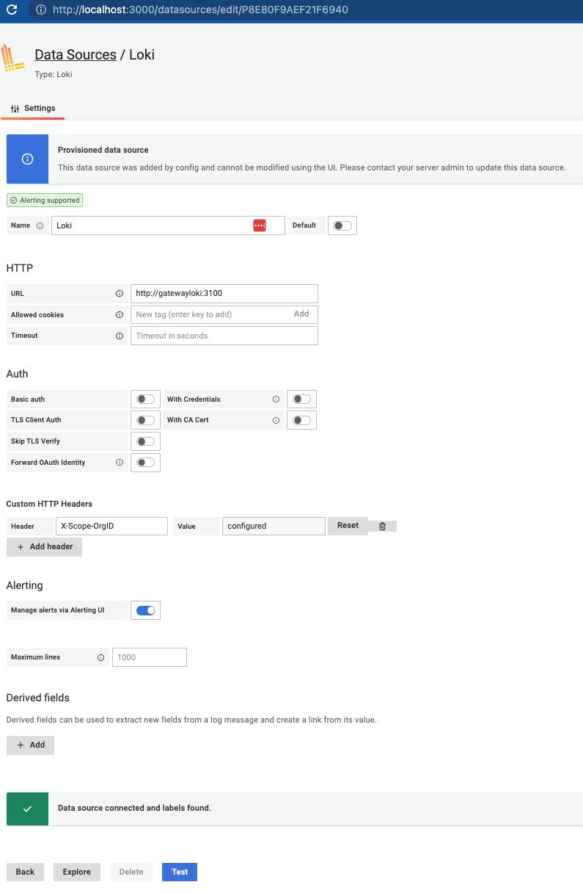
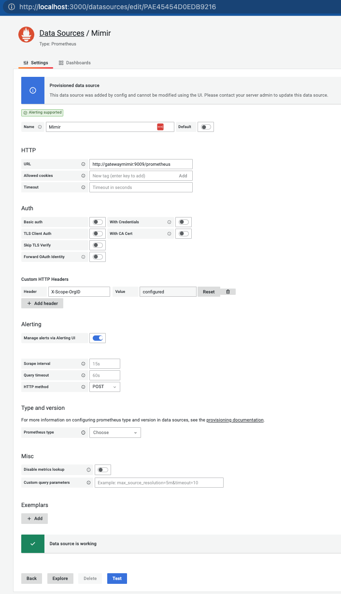
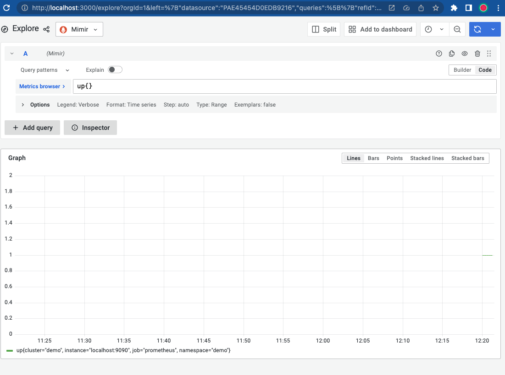
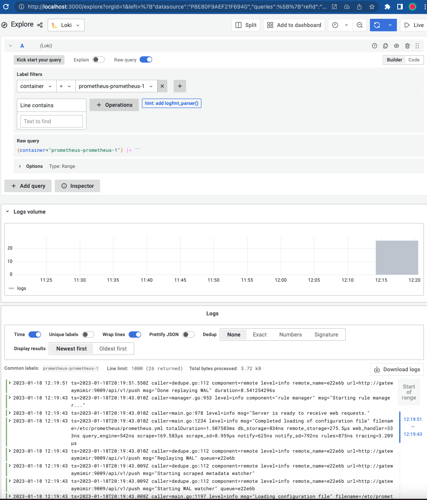

# Monitoring Demo

Get a monitoring station up and available. Seperated out into their own docker compose services that can be scaled up with the --scale feature. Allow anyone to have a monitoring setup locally and configured in a manner that an operations team can handle.

## Pre reqs:

* Docker
* Docker compose 
* Promtail (Using brew on mac in this demo)

## How to run:

Clone the repo and follow these steps

0. Create networks for docker

Seperating each service so it's independent from another. There are other ways to handle the networking, this is done so killing a "docker compose up" doesn't kill the other services because they are attaching to the other networks 

```
docker network create loki
docker network create mimir
brew install promtail
```

1. Start Logs backend in a terminal

Not necessary to include the `scale` parts but wanted to show how to do so 

```
cd loki 
docker compose up --scale write=1 --scale read=1 
```

2. Start promtail stream in a terminal

Configured out of the box to grab prometheus logs due to the name of the container & creates a positions.yaml file.

```
cd promtail
promtail --config.file=promtail.yaml 
```

3. Start Metrics backend in a terminal

Necessary to have multiple replicas of each, so the scale is needed

```
cd mimir
docker compose up --scale ingester=3 --scale distributor=2 
```

4. Start Metrics feed prometheus in a terminal 

Only feeds prometheus metrics currently, will be adding in cadvisor & sample application that publishes a scrap point for it

```
cd prometheus
docker compose up 
```

5. Start Dashboarding/Query Frontend in a terminal

```
cd grafana
docker compose up
```

## Recommendation once everything is up

Checkout grafana explore at http://localhost:3000/explore

You will be able to query prometheus output through the Loki datasource for logs & Mimir for metrics 

## Services:

* Loki:       http://localhost:3100
* Promtail
* Mimir:      http://localhost:9009
* Prometheus: http://localhost:9090
* Grafana:    http://localhost:3000

## Data source Screenshots to check to make sure things are working on Grafana:











### Data transfer through tenant with Prometheus and Promtail

Our backend services use Tenant IDs through the header `X-Scope-OrgID`. Prometheus sends it's metrics through it's config file with `mimirlocal` & Promtail sends it's logs with `lokilocal`. Grafana is configured to use these. Use proper organization structure to keep environments clean by using these tenant IDs 

### Secrets you need to be aware about

Inside loki and mimir, they both use S3 storage points with an `access_key_id` and `secret_access_key` with access their own "S3" bucket. Be sure to handle these parts properly with cloud deployment structure and secret management

## Benefits and what you can accomplish with this demo as a starting point

* Logs will be captured from the promtail config file to loki
* Metrics are captured through prometheus and sent to mimir
* Grafana has both data sources defined when brought up, you can start adjusting your prometheus config and promtail config to add in your other 
* All services are scalable because they are defined using gRPC communcation to talk with each other.
* There are load balancers in front of both backends so you can get to them on your browser
* Both Mimir and Loki use a service called minio to simulate an S3 like backend, it's intended that all provisioned storage is through that type of service that is flushed with loki and mimir over time. 
* When you want to deploy to a cloud service, you already have a built in scaling by component for both Mimir and Loki 


### Clean up jobs

All the data should be saved in .data/ for mimir and loki. That data doesn't not actually get saved until you flush either backend to be saved

#### Docker parts

* Clean up containers: `docker ps -qa | xargs docker rm`
* Clean up images: `docker images -q | xargs docker rmi`
* Clean up networks: `docker network prune` 
* Force destroy **all** docker components: `docker system prune --all --force --volumes` 

### Footnotes and references

I feel like people are intimidated with Kubernetes and the high requirements of other services. I wanted to get something approachable that includes sample applications like a node service, a python app or something along those lines. I will be including cadvisor and sample applications to showcase everything

This was inspired by a few tutorials and demos. 

* Play with Mimir: https://grafana.com/tutorials/play-with-grafana-mimir/
* Loki getting started: https://github.com/grafana/loki/tree/main/examples/getting-started
* New in Grafana 2.4 https://www.youtube.com/watch?v=M8nYWBpbwWg 
* Ward Bekker's gist: https://gist.github.com/wardbekker/6abde118f530a725e60acb5adb04508a
* Getting started with Grafana Mimir: https://www.youtube.com/watch?v=pTkeucnnoJg  
